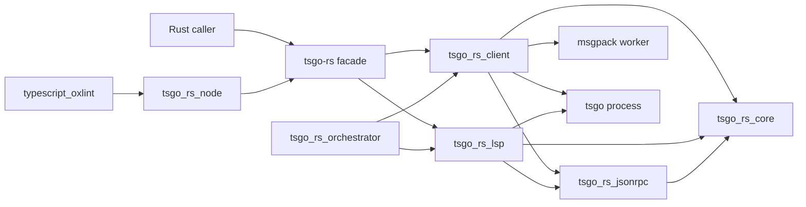

# Project Architecture, Strategy, and Implementation Tips

This document is the high-level map for `tsgo-rs`.
It explains what the repository is trying to achieve, which constraints shape the design, how the crates fit together, and what patterns are worth following when extending the project.

If you want measured numbers, go to [performance.md](./performance.md).
If you want benchmark rationale, go to [benchmarking_guide.md](./benchmarking_guide.md).
If you want CI and local reproduction details, go to [ci_guide.md](./ci_guide.md).

## Why This Project Exists

`tsgo-rs` exists to make `typescript-go` usable from Rust and Node.js in production-style workflows without maintaining a fork of upstream.

In practical terms, the repository is trying to provide:

- typed Rust bindings for the upstream `tsgo` API and LSP surfaces
- fast transport and orchestration layers for repeated editor-like queries
- Node bindings that preserve Rust-side performance while keeping JS and TS authoring ergonomic
- a strict and auditable upstream pin so regressions are reproducible

The key idea is simple:

- we do not want to reimplement the TypeScript checker
- we do want to build a strong systems layer around the real upstream checker

That systems layer is where most of the repository's value lives.

## Non-Negotiable Constraints

Several decisions in the codebase look unusual until you read them through the repository's constraints.

### 1. No Forks, No Patches

This repository intentionally does not patch `typescript-go`.

That means:

- behavior claims stay attributable to an exact upstream commit
- benchmark wins have to come from transport and orchestration, not private engine modifications
- upgrading upstream is work, but it is honest work

This policy is enforced through `ref/typescript-go`, `tsgo_ref.lock.toml`, and `tsgo_rs_ref`.

### 2. Reproducibility Beats Convenience

The project prefers:

- exact upstream pins
- exact benchmark reports
- exact baseline tests
- strict verification of the managed ref

over a looser "mostly works on my machine" development style.

That strictness is deliberate.
Without it, regressions in a fast-moving upstream project become very hard to reason about.

### 3. Workflow Speed Matters More Than Single-Call Glory

`tsgo-rs` sits on top of `tsgo`.
If both are asked to do exactly the same work exactly once, parity is the healthy target.

The realistic win conditions are:

- process reuse
- snapshot reuse
- lower-overhead transport
- narrower, targeted queries instead of rerunning a whole CLI command
- orchestration across multiple workers

This shapes almost every performance-related choice in the repository.

### 4. Process Cleanup Is Correctness

The repository treats subprocess cleanup as part of correctness, not as polish.

Why:

- leaked workers distort later benchmarks
- leaked workers waste resources in editor and CI scenarios
- unreaped children become operational debt

This is why process guards and explicit kill-plus-wait logic exist even in code that "only benchmarks" or "only runs tests".

## Architectural Overview

At a high level, the repository looks like this:

The mental model is:

- `core` owns shared primitives and process safety
- `jsonrpc` owns framing and generic request/response machinery
- `client` owns typed API bindings
- `lsp` owns LSP transport and virtual-document overlays
- `orchestrator` owns pooling, caching, and replicated state
- `runtime` keeps async execution lightweight and local to the repository
- `ref` owns upstream pinning and verification
- `tsgo_rs_node` and `typescript_oxlint` expose the Rust engine to JS and TS consumers

## Workspace Walkthrough

### `tsgo_rs_core`

Role:

- shared error type
- process lifecycle helpers
- compact fast-path aliases

Why it exists:

- the higher crates need one consistent error surface
- process cleanup policy should be implemented once
- hot-path data structure choices should be shared, not repeated ad hoc

Touch this crate when:

- adding a new cross-cutting error case
- adjusting process shutdown behavior
- changing low-level shared performance primitives

### `tsgo_rs_jsonrpc`

Role:

- `Content-Length` frame parsing and writing
- request ID and message modeling
- thread-backed JSON-RPC connection management

Why it exists:

- both the stdio API client and the LSP client need the same protocol machinery
- keeping transport generic avoids baking tsgo-specific concepts into the protocol layer

Touch this crate when:

- a protocol bug appears in request/response handling
- a callback or event routing issue shows up
- a transport-level benchmark regression points at JSON-RPC framing or synchronization

### `tsgo_rs_client`

Role:

- typed bindings for the upstream `tsgo --api` surface
- support for both async JSON-RPC and sync msgpack stdio transports
- snapshot lifecycle management
- symbol, type, and relation query methods

Why it exists:

- the wire protocol should be close to upstream
- consumers should not have to hand-author JSON payloads for every call

Touch this crate when:

- adding a new upstream API endpoint
- refining Rust-side response or handle modeling
- changing transport defaults or behavior

### `tsgo_rs_lsp`

Role:

- `tsgo --lsp --stdio` client
- virtual document and overlay handling
- custom LSP request definitions such as `initializeAPISession`

Why it exists:

- editor-like workflows need in-memory document state, not just on-disk files
- LSP and stdio API are related, but not the same integration surface

Touch this crate when:

- adding editor-oriented features
- debugging overlay or UTF-16 position handling
- replicating virtual state through higher-level orchestration

### `tsgo_rs_orchestrator`

Role:

- worker prewarming
- round-robin leasing
- snapshot caching
- result memoization
- distributed replicated state for experiments

Why it exists:

- this is the layer where workflow-level wins can happen
- the repository wants to measure and exploit reuse explicitly

Touch this crate when:

- building higher-level services on top of `tsgo`
- adding new caching strategies
- experimenting with replicated editor state

### `tsgo_rs_runtime`

Role:

- tiny local `block_on`
- thread-backed `spawn`
- lightweight broadcast channel

Why it exists:

- the project wants runtime control without making `tokio` a transitive architectural commitment
- the async needs are focused and local

Touch this crate when:

- runtime behavior itself is the problem
- a higher crate genuinely needs a new primitive

Do not touch it casually:

- every new primitive added here becomes an architectural choice for the whole workspace

### `tsgo_rs_ref`

Role:

- exact upstream lockfile modeling
- managed checkout sync and verification

Why it exists:

- reproducibility needs a first-class tool, not a convention

Touch this crate when:

- the upstream pinning policy changes
- CI or local reproduction around `ref/typescript-go` needs stronger guarantees

### `tsgo_rs`

Role:

- facade crate
- mock server
- benchmark binaries
- integration tests against the full workspace

Why it exists:

- consumers often want one import surface
- repo-level tests and benchmark runners need a home

### `npm/tsgo_rs_node`

Role:

- `napi-rs` binding between Rust and JS

Why it exists:

- JS users should be able to use the Rust implementation without losing the performance work done in Rust

Touch this package when:

- a Rust capability needs to be surfaced to JS
- the JS wrapper API shape should change

### `npm/typescript_oxlint`

Role:

- type-aware JS and TS authoring model similar to `typescript-eslint`
- compatibility layer over the Rust and Node bindings

Why it exists:

- end users want to write custom rules in JS and TS, not in Rust
- the repository wants the heavy work in Rust while keeping authoring ergonomics high

Touch this package when:

- parser services, checker shims, or rule ergonomics need to evolve
- parity with upstream or `typescript-eslint`-style workflows matters

## End-to-End Flows

### API Flow

Typical path:

1. Build an `ApiSpawnConfig`.
2. Spawn an `ApiClient`.
3. Initialize once.
4. Create or refresh a snapshot.
5. Resolve projects, symbols, and types against that snapshot.
6. Close the client or let an orchestrator keep it warm.

Important properties:

- `ApiClient` caches `initialize`
- `ManagedSnapshot` releases its handle automatically on drop
- msgpack keeps the hottest stdio path leaner than JSON-RPC

### LSP Flow

Typical path:

1. Spawn `LspClient`.
2. Create an `LspOverlay`.
3. Open or synthesize `VirtualDocument`s.
4. Apply `VirtualChange`s in UTF-16 coordinates.
5. Let the overlay emit `didOpen`, `didChange`, and `didClose`.

Important properties:

- overlay state is authoritative for open in-memory documents
- UTF-16 handling is centralized in `VirtualDocument`
- virtual-document behavior is intentionally close to editor semantics

### Orchestration Flow

Typical path:

1. Name a worker configuration with `ApiProfile`.
2. Prewarm workers for that profile.
3. Cache snapshots by stable application keys.
4. Memoize expensive derived results by key and TTL.
5. Fan work out across multiple workers when parallelism helps.

Important properties:

- caching and pooling are explicit, not accidental
- workflow speedup comes from reuse and narrower queries
- distributed replication mirrors metadata and virtual state, not every live process detail

### Node Flow

Typical path:

1. Build Rust code and `napi-rs` bindings.
2. Import `@tsgo-rs/tsgo-rs-node` or the higher-level compatibility layer.
3. Use Rust-backed checker or session behavior from JS and TS.

Important properties:

- Rust stays the performance-critical implementation
- JS and TS stay the customization surface

## Strategy Guide

### Why Msgpack Is the Default

`ApiSpawnConfig::new()` defaults to `SyncMsgpackStdio`.

That is not because JSON-RPC is wrong.
It is because the measured hot paths consistently show that sync msgpack is the better default for:

- repeated requests
- binary-heavy paths
- latency-sensitive editor-like use

JSON-RPC remains valuable because:

- it is easier to inspect by eye
- it works well with callback-driven flows
- it maps naturally onto LSP-style transport thinking

The repository treats JSON-RPC as an important compatibility and debugging path, not as the fastest default.

### Why the Runtime Is Custom

The repository currently avoids `tokio` and similar full runtimes.

Reasons:

- the async needs are narrow
- stdio and worker-thread usage dominates
- owning the runtime primitives keeps the dependency surface and execution model simpler

This should not become dogma.
If the project grows into a shape where a larger runtime genuinely simplifies correctness, the repository can revisit the choice.
For now, the custom runtime is a deliberate fit, not novelty.

### Why Some Payloads Stay Opaque

Some endpoints still return `EncodedPayload` instead of a fully decoded Rust AST.

That is intentional.

Reasons:

- the upstream payload is already structured for `tsgo`
- decoding everything eagerly would add cost and maintenance surface
- many consumers only need to round-trip or print the payload

The repository should decode more only when a real consumer and a stable value case exist.

### Why the Ref Verification Is Strict

`verify_ref` insists on:

- exact pinned commit
- detached `HEAD`
- clean tracked worktree

That strictness keeps several higher-level guarantees valid:

- regression baselines stay attributable
- benchmark results stay attributable
- bug reports can cite a real upstream revision

Weakening this policy would make the repository easier to use casually and harder to trust technically.

## Implementation Tips

### When Adding a New API Endpoint

Recommended pattern:

1. Find the upstream endpoint name and wire shape.
2. Add or reuse a small request struct in `requests_*`.
3. Add a typed response struct if the shape deserves one.
4. Add a method on `ApiClient` in the appropriate `methods_*` module.
5. Prefer names that mirror upstream closely.
6. Add a mock-server integration test.
7. Add a real-tsgo regression test if the endpoint matters to compatibility.

Good instincts:

- keep wire modeling boring
- keep serde names aligned with upstream field names
- normalize optional/empty response shapes intentionally, not accidentally

### When Adding LSP Features

Recommended pattern:

1. Decide whether the feature belongs in transport, overlay, or custom request types.
2. Keep UTF-16 position logic centralized in `VirtualDocument`.
3. Preserve real LSP sequencing rules around open/change/close.
4. Add tests that cover invalid ranges and duplicate lifecycle events.

Good instincts:

- treat editor semantics as the truth model
- avoid inventing a second overlay abstraction when `VirtualDocument` can stay the source of truth

### When Changing Process Behavior

Checklist:

- does the child process get terminated on all paths?
- is the child always reaped?
- will this affect benchmark correctness?
- will this affect long-lived editor or test sessions?

Good instincts:

- prefer explicit shutdown paths
- treat zombie prevention as part of the feature, not cleanup trivia

### When Extending the Orchestrator

Checklist:

- what exactly is being reused?
- what is keyed by profile?
- what is keyed by logical workspace or request?
- what is safe to replicate?
- what remains process-local?

Good instincts:

- cache only what has a clear invalidation story
- keep replicated state deterministic
- keep live process handles and replicated metadata conceptually separate

### When Touching `typescript_oxlint`

Checklist:

- does the source-level TS surface still line up with the Rust and Node binding shape?
- does `vp check` still work before build artifacts exist?
- are you depending on generated output where source should be enough?

Good instincts:

- point source checks at source
- treat compatibility code as a real consumer, not as temporary glue

## Common Pitfalls

### Mistaking Wrapper Wins for Engine Wins

If `tsgo-rs` wins in an editor-style benchmark, that does not mean it out-compiled `tsgo`.
It usually means it:

- reused state
- avoided startup cost
- narrowed the workload

That is still a real win.
It is just a different kind of win.

### Treating JSON-RPC and Msgpack as Interchangeable Internally

They are equivalent at the conceptual API level.
They are not equivalent in:

- framing cost
- callback handling shape
- debugging ergonomics
- hot-path performance

Transport choices are part of the design, not just configuration trivia.

### Relaxing Upstream Pin Hygiene to Unblock Local Work

It is tempting to "just let verify pass" when the managed ref is dirty.
Do not do that.

The better pattern is:

- restore accidental drift
- pin intentionally when upgrading
- keep the lockfile and checkout relationship exact

### Over-Decoding Binary Payloads

If a consumer only needs to print or forward a binary node payload, fully decoding it into Rust structures may add complexity without producing value.

Prefer:

- opaque payloads first
- richer decoding only with a concrete use case

## Recommended Development Workflow

For most work:

1. `vp check`
2. `cargo test --workspace`
3. if the change touches the real upstream path, run the real-tsgo regression tests
4. if the change touches performance-sensitive code, run the relevant benchmark layer
5. if the change touches docs.rs-facing Rust API, run `RUSTDOCFLAGS='-D warnings' cargo doc --workspace --no-deps`

For upstream pin updates:

1. sync the managed ref
2. move it intentionally to the new upstream commit
3. pin current metadata
4. rebuild the real `tsgo`
5. rerun regression tests and benchmarks

## How to Read the Repository Efficiently

If you are new to the codebase, this reading order works well:

1. [README.md](../README.md)
2. this guide
3. crate roots under `crates/*/src/lib.rs`
4. `tsgo_rs_client` methods and response types
5. `tsgo_rs_lsp` overlay and virtual document logic
6. `tsgo_rs_orchestrator` pooling, state, and Raft code
7. benchmark runners under `crates/tsgo_rs/src/bin`

If you are debugging performance:

1. [benchmarking_guide.md](./benchmarking_guide.md)
2. [performance.md](./performance.md)
3. `bench_real_tsgo`
4. transport code in `client`, `jsonrpc`, and `runtime`

If you are debugging CI or environment issues:

1. [ci_guide.md](./ci_guide.md)
2. `vite.config.ts`
3. `tsgo_rs_ref`
4. the managed upstream checkout under `ref/typescript-go`

## Final Mental Model

The easiest way to reason about `tsgo-rs` is:

- upstream `tsgo` is the compiler engine
- this repository is the systems layer around that engine

That systems layer is responsible for:

- safe process control
- transport quality
- typed API ergonomics
- editor-style virtual state
- worker reuse
- benchmark discipline
- upstream reproducibility
- JS and TS integration ergonomics

If a proposed change improves one of those without violating the repository's core constraints, it is probably moving in the right direction.
